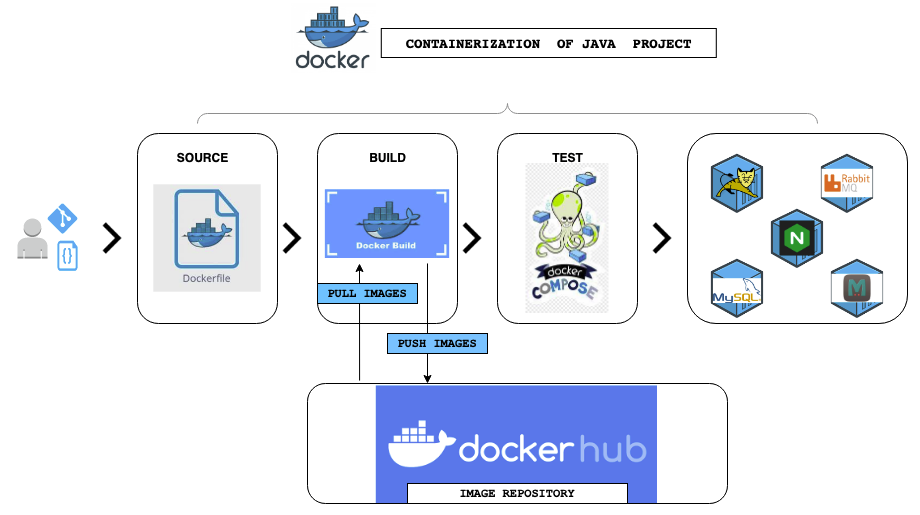
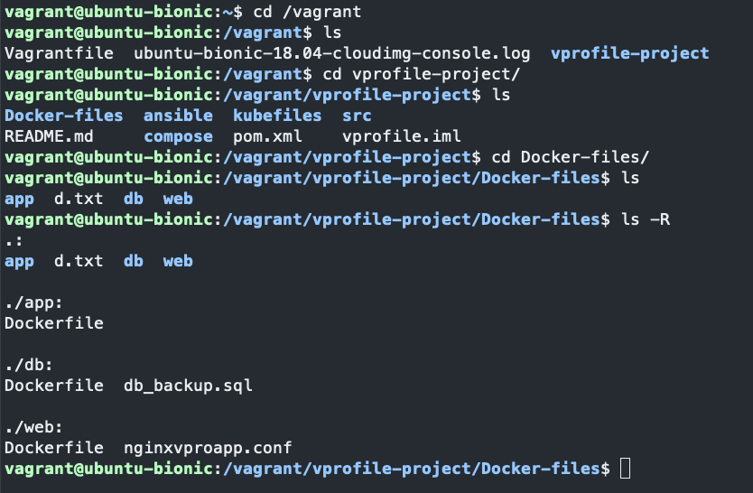
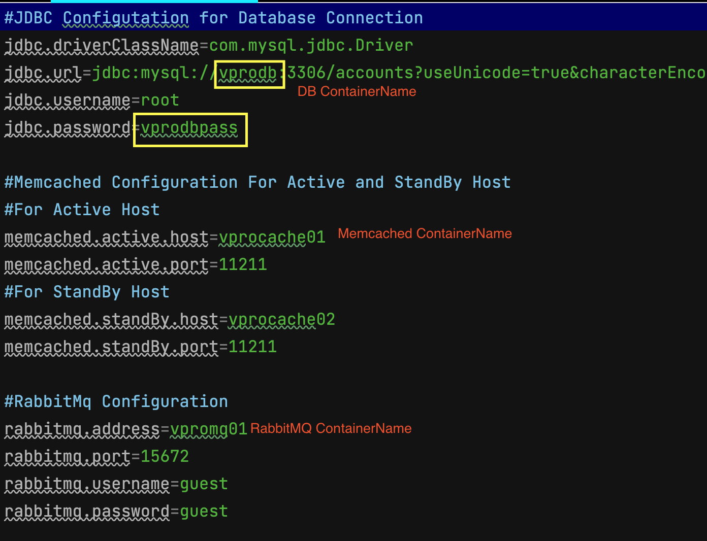
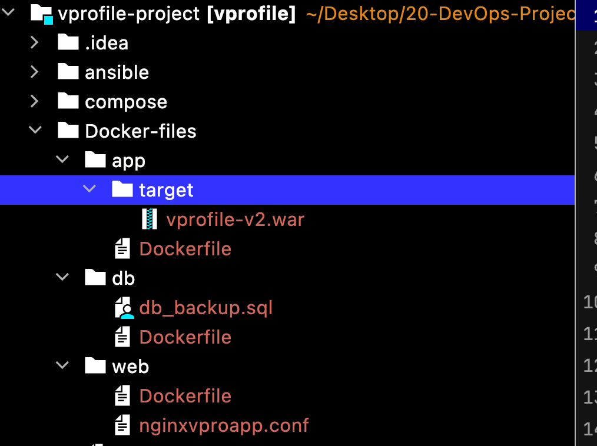
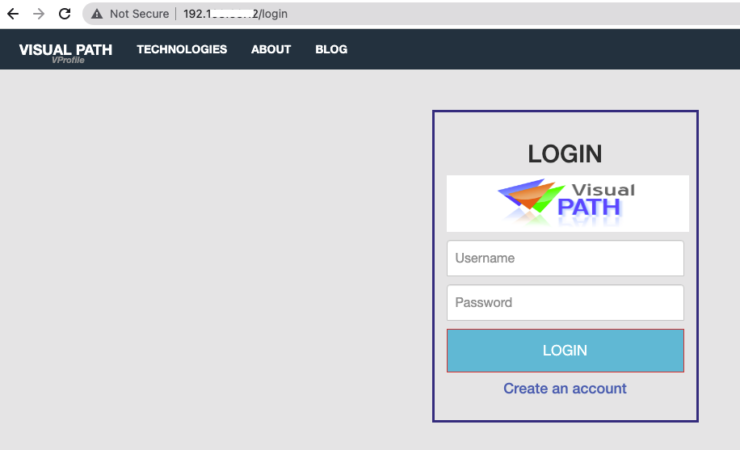
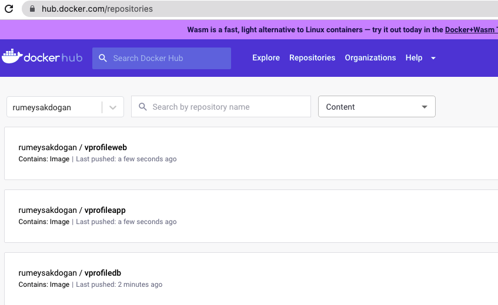

# Project-12: Containerization of Java Application using Docker

[*Project Source*](https://www.udemy.com/course/devopsprojects/?src=sac&kw=devops+projects)



## Pre-requisities:

* DockerHub account
* VirtualBox setup or AWS account to create a server to test

### Step-1: Overview of Base Images

For Base images, we will go to [DockerHub](https://hub.docker.com/) which is Container Image Repository.

For our application we need five images for below services:
* Tomcat (need to create our customized image from base image)
* MySQL (need to create our customized image from base image)
* Memcached (we can use base image and override settings)
* RabbitMQ (we can use base image and override settings)
* Nginx (need to create our customized image from base image)

### Step-2: DockerHub Setup

We will store our images in DockerHub. If you don't have DockerHub account, you can sign-up for free from the [website](https://hub.docker.com/)

### Step-3: Setup Docker Engine

We will create an Ubuntu machine with Vagrant to run our Docker commands.
First. lets create a new directory `docker-engine`. We will run `vagrant init ubuntu/bionic64` command which will create an Ubuntu 18.04 machine for us. 
```sh
mkdir docker-engine
cd docker-engine
vagrant init ubuntu/bionic64
```

We can give an IP address by updating `Vagrantfile` to access the VM. Uncomment the line given below, which will create a Private network only host can use it to test in this VM.

```sh
vim Vagrantfile
### Uncomment the config.vm.network in the Vagrantfile like below ###
# Create a private network, which allows host-only access to the machine
# using a specific IP.
config.vm.network "private_network", ip: "192.168.33.12"
```

Time to create the VM. And ssh into it.
```sh
vagrant up
vagrant ssh
```

We will go to official [Docker Documentation](https://docs.docker.com/engine/install/ubuntu/) to get Docker installation steps for Ubuntu 18.04.
Follow the installation steps. Once all steps completed, run below command:
```sh
docker --version
```

We need to add `vagrant` user to `Docker` group to be able to run docker commands. Once we add the user, we will exit and log back in. Now we are able to run docker commands successfully.
```sh
whoami
docker images
sudo usermod -aG docker vagrant
exit
vagrant ssh
id # verify that vagrant user is part of docker group now
docker images 
```


### Step-4: Dockerfile References

I will use IntelliJ (any IDE is fine) while creating my images. First I will clone the repository in the same directory that I have created my Vagrantfile, this will give me chance to quickly test Docker images that I will create for my application services.


Next checkout the branch `docker`. You will see there is `Docker-files` directory, we will create our images under this directory. 

[Click here to go to official website for Dockerfile creation](https://docs.docker.com/engine/reference/builder/)

### Step-5: Dockerfile for App Image[TOMCAT]

Create an `app` directory under `Docker-files` directory. Copy the below content to a file named as `Dockerfile`.

```sh
FROM tomcat:8.5.84-jre11
LABEL "Project"="Vprofile"
LABEL "Author"="Rumeysa"
RUN rm -rf /usr/local/tomcat/webapps/*
COPY target/vprofile-v2.war /usr/local/tomcat/webapps/ROOT.war
EXPOSE 8080
CMD ["catalina.sh", "run"]
WORKDIR /usr/local/tomcat/
VOLUME /usr/local/tomcat/webapps
```

### Step-6: Dockerfile for DB Image[MYSQL]

Create an `db` directory under `Docker-files` directory. Copy the below content to a file named as `Dockerfile`.
```sh
FROM mysql:5.7.25
LABEL "Project"="Vprofile"
LABEL "Author"="Rumeysa"
ENV MYSQL_ROOT_PASSWORD="vprodbpass"
ENV MYSQL_DATABASE="accounts"
ADD db_backup.sql /docker-entrypoint-initdb.d/db_backup.sql
```

We need to copy db_backup.sql file from `src/main/resources` directory to `db` directory where our DB Dockerfile exists.

### Step-7: Dockerfile for Web Image[NGINX]

Create an `web` directory under `Docker-files` directory. Copy the below content to a file named as `Dockerfile`.

```sh
FROM nginx
LABEL "Project"="Vprofile"
LABEL "Author"="Rumeysa"
RUN rm -rf /etc/nginx/conf.d/default.conf
COPY nginxvproapp.conf /etc/nginx/conf.d/vproapp.conf
```

We will create our own nginxvproapp.conf file under `web` directory with below content, and replaced in the container with default config file.
```sh
upstream vproapp{
  server vproapp:8080;
}
server{
listen 80;
location / {
 proxy_pass http://vproapp;
 }
}
```

### Step-8: Building Images

Before building the images, we need to have our artifact in the target directory `target/vprofile-v2.war`.

We can check the files from our VM by executing below commands:



Time to build our artifact. To be able to create our artifact we need Maven and JDK installed. We will install them in our Ubuntu VM by executing below commands. I am in `vprofile-project` dircetory now.

```sh
sudo apt install openjdk-8-jdk -y && sudo apt install maven -y
```
Installation complete.


We need to make sure the containers we will create with Docker images will comply with the settings we mentioned in `application.properties` file as  below. Otherwise application cannot run properly.



Time to build our artifact. From project directory, run `mvn install` command.


Build is success and our artifact is generated under `/target` directory.


We need to copy the artifact under `Docker-files/app` directory.



#### Building app image

Let's build our images now. Go to`/Docker-files/app` directory.Run below command:
```sh
docker build -t <docker_hub_username>/vprofileapp:V1 .
docker images
```

#### Building db image

Let's build our images now. Go to`/Docker-files/db` directory.Run below command:
```sh
docker build -t <docker_hub_username>/vprofiledb:V1 .
docker images
```

#### Building web image

Let's build our images now. Go to`/Docker-files/web` directory.Run below command:
```sh
docker build -t <docker_hub_username>/vprofileweb:V1 .
docker images
```

#### Building RabbitMQ&Memcached image

We don't need any customization for RabbitMQ&Memcached images. We can directly pull from DockerHub.
```sh
docker pull memcached
docker pull rabbitmq
```
Our Docker images are ready. Next we will build our containers with `Docker compose`.


### Step-9: Seting up Docker-Compose

To run docker-compose commands, first we need to install it. We can go to [official documentation](https://docs.docker.com/compose/install/) and follow installation steps. 
```sh
curl -SL https://github.com/docker/compose/releases/download/v2.14.0/docker-compose-linux-x86_64 -o /usr/local/bin/docker-compose

sudo chmod +x /usr/local/bin/docker-compose
docker-compose --version
```
Docker-compose is installed, next we will create `docker-compose.yml` file in the root directory of project which will create our containers.

We have to give container names same as given in `application.properties` and `nginxvproapp.conf` files.

If we are not sure which port to map or where to map to volume, we can use below command to get info:
```sh
docker inspect <image_name>:<version_tag>
```

Create `docker-compose.yml` with below content. 
```sh
version: '3'
services:
  vprodb:
    image: <your_dockerhub_username>/vprofiledb:V1 
    ports:
      - "3306:3306"
    volumes:
      - vprodbdata:/var/lib/mysql
    environment:
      - MYSQL_ROOT_PASSWORD=vprodbpass

  vprocache01:
    image: memcached
    ports:
      - "11211:11211"

  vpromq01:
    image: rabbitmq
    ports:
      - "15672:157672"
    environment:
      - RABBITMQ_DEFAULT_USER=guest
      - RABBITMQ_DEFAULT_PASS=guest

  vproapp:
    image: <your_dockerhub_username>/vprofileapp:V1 
    ports:
      - "8080:8080"
    volumes:
      - vproappdata:/usr/local/tomcat/webapps

  vproweb:
    image: <your_dockerhub_username>/vprofileweb:V1 
    ports:
      - "80:80"

volumes:
  vprodbdata: {}
  vproappdata: {}
```

### Step-10: Run Containers & Test

We will go to directory where we have our `docker-compose.yml` file and run below command:
```sh
docker-compose up
```


We can use the IP address that we uncomment in Vagrantfile in Step3 to check the application from browser.



### Step-11: Push Images to DockerHub

Next we will push our images to DockerHub. First we need to login to DockerHUb with below command and provide username/password.
```sh
docker login
```

Once we got `Login Succeeded` message, we can push our images with below commands:
```sh
docker push <dockerhub_username>/vprofiledb:V1
docker push <dockerhub_username>/vprofileapp:V1
docker push <dockerhub_username>/vprofileweb:V1
```

We can check in our DockerHub account from browser.

